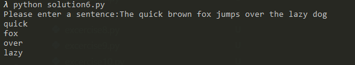

# Pands-Problem-Set, Ross Hunter, 2019

This repository contains my solutions to pands problem set as part of programming and scripting module for Higher Diploma in Data Analytics, GMIT.
[See here for instructions](https://github.com/ianmcloughlin/problems-pands-2019/raw/master/problems.pdf)

## Instructions on how to Download Repository

1. Sign into Github
2. Navigate to the following page :(https://github.com/rossdavidhunter/pands-problem-set)
3. On Top Right of screen in green click on Clone or Download button
4. Open in Desktop or download ZIP

## How to run code and what is required

1. Install Python 
2. Install Video Studio Code
3. Install CMDER
4. Setup GitHub and Respository

## Breakdown of each solution

1. Solution1.py contains my solution to when a positive integer is entered the output is the sum of all numbers between one and that number.

                         

2. Solution2.py outputs whether or not today is a day that begins with the letter T.

                          

3. Solution3.py and Solution3alt.py prints all numbers between 1000 and 10000 that are divisable by 6 but not by 12.

                                                       

4. Solution4.py asks user to enter a postive integer and calculates the following, calculates next value by taking current value      and if it is even divide by 2 and if odd multiply by 3 and add 1. Program will end when current value is one.

5. Solution5.py asks user to enter a positive integer and tells user whether or not number is a prime number.

6. Solution6.py asks user to enter a sentence and outputs every second word

7. Solution7.py takes a positive floating point number as input and outputs approximation of square root.

  

8. Solution8.py outputs todays date and time as "Day, Month, Day, Year at hh:mm pm"

9. Solution9.py reads a text file and outputs every second line. The file is read from command line.

                   

10. Solution10.py displays a plot of functions X, X and 2 in the range [0,4].

## References

[Python Community and Tutorials](https://www.python.org/)
[A Whirlwind Tour of Python](https://www.oreilly.com/programming/free/files/a-whirlwind-tour-of-python.pdf) 
[GitHub](https://github.com/)
[Stackoverflow](https://stackoverflow.com/)
[Python Crash Course](http://ehmatthes.github.io/pcc/index.html)
[Terrible at Maths](https://terribleatmaths.wordpress.com/)
[The Coder’s Apprentice](http://spronck.net/pythonbook/pythonbook.pdf)
[An Introduction to Version Control Using GitHub Desktop](https://programminghistorian.org/en/lessons/getting-started-with-github-desktop)
[Anaconda](https://www.anaconda.com/)
[cmder](http://cmder.net/)
[Visual Studio Code](https://code.visualstudio.com/)

## Link to some useful videos

[Learn Python-Full Course for Beginners](https://www.youtube.com/watch?v=rfscVS0vtbw)
